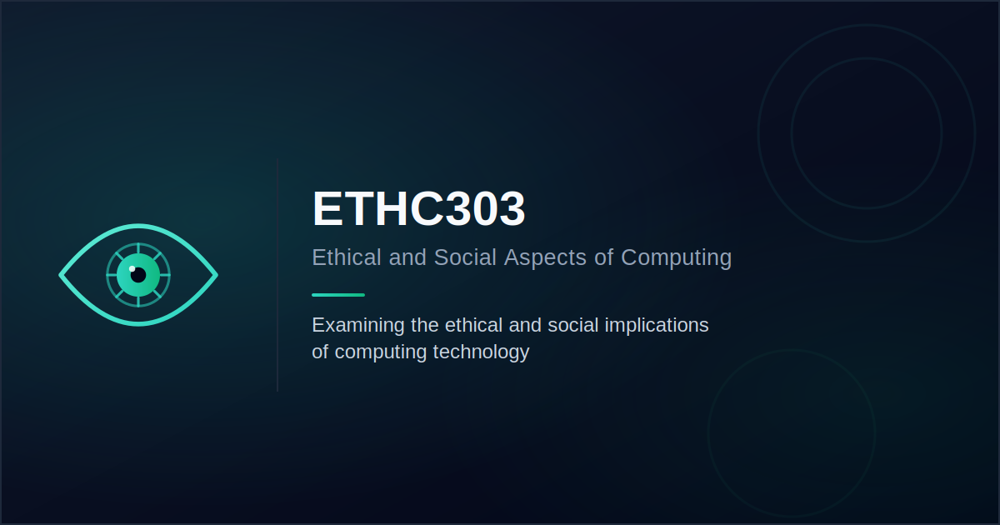

# ETHC303 — Ethical & Social Aspects of Computing

This repository is a documentation website for my ETHC303 group research project. It's not the research paper itself — it's a companion site that tracks and presents the process behind the project: progress updates, team info, sources, and the final deliverables once they're ready.

Live site: https://ethics.shoug-tech.com

## Deployment

The site is deployed automatically to GitHub Pages via a GitHub Actions workflow ([`.github/workflows/deploy.yml`](.github/workflows/deploy.yml)) on every push to `main`. The custom domain is configured through [`CNAME`](CNAME).

To enable it on GitHub: **Settings → Pages → Build and deployment → Source: GitHub Actions**.

## Why this exists

I wanted a public, organized record of how the project came together rather than just submitting a paper and PPT and being done with it. The site currently includes:

- [`index.html`](index.html) — project landing page / showcase
- [`dashboard.html`](dashboard.html) — progress tracking
- [`Reference.html`](Reference.html) — sources and references collected during research
- [`team-shoug-alomran.html`](team-shoug-alomran.html), [`team-layan-alnasser.html`](team-layan-alnasser.html) — research-team member pages

## About the assignment

**Note:** The official rubric for this offering of the course hasn't been posted yet. The text below is a rubric from a similar past offering of this activity, kept here as a reference point for scope and expectations until the real one is released. Treat details (deadlines, exact weighting, topic list) as indicative, not final.

### Activity description

This activity is designed to encourage exploration of the dynamic and ever-evolving fields of computing ethics, social impact, and sustainability. The research paper is an opportunity to explore and critically analyze various ethical and social issues within the realm of computing.

- **Weighting:** 15% of the overall course grade.

### Topic selection

Each group chooses one topic, integrating ethical, social, and sustainability perspectives:

1. Cyber World Ethics — Virtual/Augmented Reality
2. Cyber World Ethics — Games
3. Cyber World Ethics — Smart Homes
4. Cyber World Ethics — Smart Cities
5. Social Implications of AI and Expert Systems
6. Social Implications of Data Mining
7. Social Implications of Softbots
8. Social Implications of Drones

### Research paper requirements

1. Ethical and responsible use of generative AI (AI-generated content must not exceed 30%).
2. Maximum allowed similarity score: 24% (Turnitin), excluding references.
3. Length: 11–12 pages excluding references, 12-pt Times New Roman, double-spaced, single column.
4. Citations in a recognized academic style (APA, MLA, or Chicago).
5. Title and authors' information.
6. Abstract summarizing the key points.
7. Introduction outlining relevance and importance of the topic.
8. Literature review (each student must discuss at least two papers, including at least one journal article).
9. Methodology describing methods and sources used.
10. Analysis of ethical and social implications with well-reasoned arguments.
11. Recommendations / practical solutions for the issues raised.
12. Conclusion summarizing main points and significance.
13. References — comprehensive list of sources.

### Process notes

- Each group emails the instructor (via a designated group representative) with student names and chosen topic by week 5.
- Final submission consists of two files: the research paper and the PowerPoint presentation, submitted only by the group representative.

## Status

Work in progress — this README and site will be updated as the official rubric is released and the project develops.
